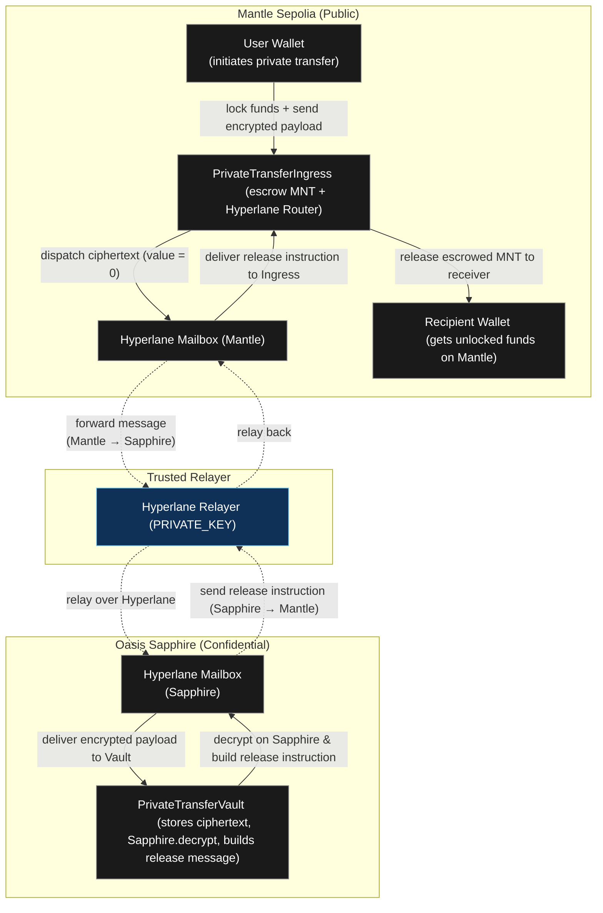

# c0gito: Private Cross-Chain Transfers on Mantle

> **THINK. TRANSFER. VANISH.**  
> Incognito mode for cryptocurrency transfers powered by Oasis Sapphire confidential computation.

[](https://www.mantle.xyz)
[](https://sapphire.oasis.io)
[](https://www.hyperlane.xyz)

## 🎯 Overview

**c0gito** is a privacy-preserving cross-chain transfer protocol that enables completely confidential cryptocurrency transfers between users. By leveraging Oasis Sapphire's confidential computing capabilities and Hyperlane's cross-chain messaging, c0gito ensures that transfer details (recipient, amount, memo) remain encrypted and private throughout the entire transaction lifecycle.

### Problem Statement

Traditional blockchain transfers expose sensitive information on-chain:
- **Recipient addresses** are publicly visible
- **Transfer amounts** are transparent
- **Transaction memos** are readable by anyone
- **Privacy concerns** prevent adoption in sensitive use cases

### Our Solution

c0gito solves this by:
- 🔒 **Encrypting transfer payloads** using X25519DeoxysII encryption before on-chain submission
- 🛡️ **Confidential processing** on Oasis Sapphire, where decryption happens in a trusted execution environment
- 🌉 **Cross-chain architecture** using Hyperlane to bridge between Mantle (public) and Sapphire (confidential)
- 📊 **Real-time indexing** with Ponder for transparent tracking without exposing private data

---

## 🏗️ Architecture



### Key Components

1. **PrivateTransferIngress** (Mantle Sepolia)
   - Accepts deposits (Native MNT)
   - Escrows funds
   - Forwards encrypted payloads via Hyperlane
   - Releases funds upon receiving decrypted instructions

2. **PrivateTransferVault** (Oasis Sapphire)
   - Stores encrypted transfer payloads
   - Decrypts using Sapphire's confidential computing
   - Builds release instructions
   - Sends instructions back to Mantle via Hyperlane

3. **Ponder Indexer**
   - Indexes events from both chains
   - Tracks deposit and transfer status
   - Provides GraphQL API for frontend

4. **c0gito Service**
   - Monitors pending transfers
   - Automatically processes transfers on Sapphire
   - Handles acknowledgment flow

5. **Frontend (Next.js)**
   - User-friendly interface for deposits and transfers
   - Real-time status tracking
   - Privacy-focused UX

---

## ✨ Features

### 🔐 Privacy Features
- **End-to-end encryption** using X25519DeoxysII
- **Confidential decryption** on Oasis Sapphire TEE
- **No on-chain exposure** of recipient, amount, or memo
- **Selective disclosure** - only encrypted hash visible on Mantle

### 🌉 Cross-Chain Capabilities
- **Seamless bridging** between Mantle and Sapphire via Hyperlane
- **Trustless messaging** using Hyperlane's security model
- **Automatic processing** with service layer

### 💰 Token Support
- **Native MNT** transfers (ERC20 support in contracts, frontend coming soon)
- **Flexible deposits** - one deposit can fund multiple transfers

### 📊 Developer Experience
- **Ponder indexer** for real-time data
- **GraphQL API** for easy integration
- **Type-safe contracts** with TypeScript
- **Comprehensive event tracking**

### 🎨 User Experience
- **Intuitive UI** with pixelated retro-futuristic design
- **Real-time status** updates
- **Transaction history** tracking
- **Responsive design** for all devices

---

## 🛠️ Tech Stack

### Smart Contracts
- **Solidity** ^0.8.24
- **OpenZeppelin** Contracts
- **Hyperlane** Core for cross-chain messaging
- **Oasis Sapphire** Contracts for confidential computing

### Frontend
- **Next.js** 16.1.1 (React 19)
- **Wagmi** & **RainbowKit** for wallet integration
- **Viem** for Ethereum interactions
- **Tailwind CSS** for styling
- **TypeScript** for type safety

### Infrastructure
- **Ponder** for event indexing
- **GraphQL** API for data queries
- **Node.js** service layer for automation

### Development Tools
- **Hardhat** for contract development
- **TypeScript** throughout

---

## 🚀 Getting Started

### Prerequisites

- Node.js 18+ and npm/yarn
- MetaMask or compatible Web3 wallet
- Mantle Sepolia testnet MNT
- Access to Oasis Sapphire Testnet

### Installation

1. **Clone the repository**
```bash
git clone https://github.com/yourusername/c0gito.git
cd c0gito
```

2. **Install dependencies**
```bash
npm install
```

3. **Set up environment variables**

Create `.env.local` in the root directory:
```env
# Mantle Sepolia
NEXT_PUBLIC_INGRESS_ADDRESS=0x...
NEXT_PUBLIC_ROUTER_ADDRESS=0x...
NEXT_PUBLIC_ISM_ADDRESS=0x...

# Oasis Sapphire
NEXT_PUBLIC_VAULT_ADDRESS=0x...
NEXT_PUBLIC_VAULT_PUBLIC_KEY=0x...

# Ponder Indexer
NEXT_PUBLIC_PONDER_GRAPHQL_URL=http://localhost:42069/graphql
```

### Environment Variables Examples

**Frontend (`.env.local`):**
```env
# Mantle Sepolia Contracts
NEXT_PUBLIC_INGRESS_ADDRESS=0xEE5F31d28F08a011f638fd2b82CCbcb5ce04ab48
NEXT_PUBLIC_ROUTER_ADDRESS=0xEE5F31d28F08a011f638fd2b82CCbcb5ce04ab48
NEXT_PUBLIC_ISM_ADDRESS=0xDfA1f3F3865a24ddD7B0A5d89ac4D80c75AD2Bc8

# Oasis Sapphire Contracts
NEXT_PUBLIC_VAULT_ADDRESS=0x418A949474971a1947d932f856FB3eAA695BDdE5
NEXT_PUBLIC_VAULT_PUBLIC_KEY=0x7e9bbbb5d644e0afacb4da4633a9dbd433febe9190edbf5c6604306be96f182d

# Ponder Indexer
NEXT_PUBLIC_PONDER_GRAPHQL_URL=http://localhost:42069/graphql
```

**Indexer (`c0gito-indexer/.env`):**
```env
PONDER_RPC_URL_MANTLE_SEPOLIA=https://rpc.sepolia.mantle.xyz
PONDER_RPC_URL_SAPPHIRE_TESTNET=https://testnet.sapphire.oasis.io
INGRESS_ADDRESS=0xEE5F31d28F08a011f638fd2b82CCbcb5ce04ab48
VAULT_ADDRESS=0x418A949474971a1947d932f856FB3eAA695BDdE5
```

**Service (`c0gito-service/.env`):**
```env
PONDER_API_URL=http://localhost:42069/graphql
SAPPHIRE_RPC_URL=https://testnet.sapphire.oasis.io
VAULT_ADDRESS=0x418A949474971a1947d932f856FB3eAA695BDdE5
OWNER_PRIVATE_KEY=0x...
POLL_INTERVAL=10000
MAX_RETRIES=3
RETRY_DELAY=5000
```

4. **Start the development server**
```bash
npm run dev
```

5. **Start the Ponder indexer** (in separate terminal)
```bash
cd c0gito-indexer
npm install
npm run dev
```

6. **Start the service** (optional, for automatic processing)
```bash
cd c0gito-service
npm install
npm run dev
```

7. **Open [http://localhost:3000](http://localhost:3000)** in your browser

### Contract Deployment

See detailed deployment instructions in [`scripts/deploy/README.md`](scripts/deploy/README.md)

---

## 📖 Usage

### For Users

1. **Connect Wallet**
   - Click "CONNECT" button
   - Select Mantle Sepolia network
   - Approve connection

2. **Deposit Funds**
   - Click "DEPOSIT" button
   - Enter amount in MNT
   - Confirm transaction
   - Save your deposit ID

3. **Initiate Private Transfer**
   - Select a deposit from dropdown
   - Enter recipient address
   - Enter amount (or use percentage buttons)
   - Add optional memo
   - Click "SEND TRANSFER"

4. **Track Status**
   - View transaction status in dialog
   - Check recent transfers section
   - Monitor on Mantle Explorer

---

---

## 📁 Project Structure

```
c0gito/
├── contracts/              # Smart contracts
│   ├── PrivateTransferIngress.sol
│   ├── PrivateTransferVault.sol
│   └── TrustedRelayerIsm.sol
├── src/                    # Frontend application
│   ├── app/                # Next.js pages
│   ├── components/         # React components
│   ├── hooks/              # Custom React hooks
│   └── lib/                # Utilities & ABIs
├── c0gito-indexer/         # Ponder indexer
│   ├── src/index.ts        # Event handlers
│   └── ponder.schema.ts    # GraphQL schema
├── c0gito-service/         # Backend service
│   ├── src/monitor.ts      # Transfer monitoring
│   └── src/processor.ts   # Transfer processing
├── scripts/                # Deployment scripts
└── test/                   # Contract tests
```

---

## 🎯 Hackathon Alignment

### Track: **ZK & Privacy** 🏆

c0gito directly addresses the **ZK & Privacy** track requirements:

✅ **Privacy-preserving solutions** with regulatory compatibility  
✅ **Selective disclosure** - only encrypted hashes on public chain  
✅ **Confidential computation** using Oasis Sapphire TEE  
✅ **Regulatory-friendly** - no illegal activity, just privacy

### Additional Track Relevance

- **Infrastructure & Tooling**: Ponder indexer, GraphQL API, developer SDKs
- **DeFi & Composability**: Composable with other Mantle DeFi protocols

### Mantle Integration

- ✅ Built on **Mantle Sepolia** testnet
- ✅ Leverages **Mantle's low fees** for cost-effective transfers
- ✅ Uses **Mantle's EVM compatibility** for seamless development
- ✅ Integrates with **Mantle ecosystem** tools

---

## 🗺️ Roadmap

### Phase 1: MVP (Current) ✅
- [x] Core smart contracts
- [x] Cross-chain messaging via Hyperlane
- [x] Confidential decryption on Sapphire
- [x] Frontend interface
- [x] Ponder indexer
- [x] Service automation

### Phase 2: Enhancement (Q1 2026)
- [ ] Multi-token support (ERC20 whitelist)
- [ ] Batch transfers
- [ ] Gas optimization
- [ ] Mobile app

### Phase 3: Production (Q2 2026)
- [ ] Mainnet deployment
- [ ] Security audit
- [ ] Governance token
- [ ] DAO structure

### Phase 4: Expansion (Q3 2026)
- [ ] Additional chain support
- [ ] Advanced privacy features
- [ ] Enterprise solutions
- [ ] API marketplace

---

## 🔒 Security & Compliance

### Security Measures
- ✅ Smart contract audits (planned)
- ✅ Encrypted payload storage
- ✅ Confidential execution environment
- ✅ Access control mechanisms

### Compliance Declaration

**This project does NOT involve regulated assets.**  
c0gito is a privacy-preserving transfer protocol that:
- Does not handle securities or regulated financial instruments
- Does not require KYC/AML for basic transfers
- Operates as a technical infrastructure layer
- Complies with applicable blockchain regulations

---

## 👥 Team

**Team c0gito**

We are a team of blockchain developers passionate about privacy and user sovereignty.

- **Contact**: [Your Email]
- **Twitter**: [@YourTwitter]
- **GitHub**: [YourGitHub]

---

## 📄 License

Apache-2.0

---

## 🙏 Acknowledgments

- **Mantle Network** for the excellent L2 infrastructure
- **Oasis Sapphire** for confidential computing capabilities
- **Hyperlane** for cross-chain messaging
- **Ponder** for the indexing framework
- **OpenZeppelin** for battle-tested contracts

---

## 📞 Support & Links

- **Live Demo**: [Your Demo URL]
- **Documentation**: [Your Docs URL]
- **Video Demo**: [Your Video URL]

### Deployed Contracts

**Mantle Sepolia:**
- **PrivateTransferIngress**: [`0xEE5F31d28F08a011f638fd2b82CCbcb5ce04ab48`](https://sepolia.mantlescan.xyz/address/0xEE5F31d28F08a011f638fd2b82CCbcb5ce04ab48)
- **TrustedRelayerIsm**: [`0xDfA1f3F3865a24ddD7B0A5d89ac4D80c75AD2Bc8`](https://sepolia.mantlescan.xyz/address/0xDfA1f3F3865a24ddD7B0A5d89ac4D80c75AD2Bc8)

**Oasis Sapphire Testnet:**
- **PrivateTransferVault**: [`0x418A949474971a1947d932f856FB3eAA695BDdE5`](https://testnet.explorer.sapphire.oasis.dev/address/0x418A949474971a1947d932f856FB3eAA695BDdE5)
- **Vault Public Key**: `0x7e9bbbb5d644e0afacb4da4633a9dbd433febe9190edbf5c6604306be96f182d`

---

## 🏆 Why c0gito Should Win

1. **Technical Excellence**: Novel architecture combining Mantle, Sapphire, and Hyperlane
2. **Real-World Applicability**: Solves genuine privacy concerns in DeFi
3. **User Experience**: Intuitive interface with real-time feedback
4. **Mantle Integration**: Deep integration with Mantle's modular stack
5. **Long-Term Potential**: Scalable foundation for privacy-preserving DeFi

---

**Built with ❤️ for the Mantle Global Hackathon 2025**
